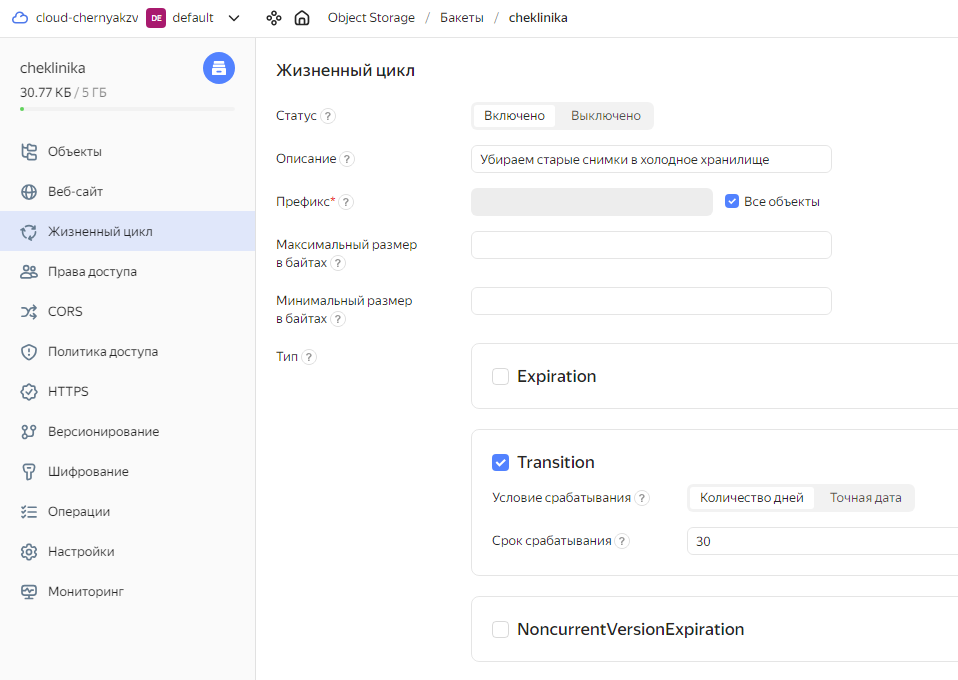
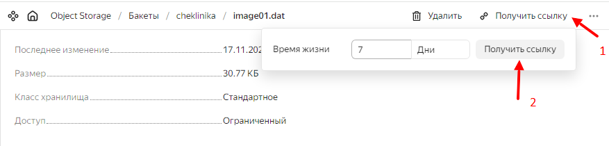

# Практическая работа. Создание бакетов и загрузка объектов. Работа с утилитой S3cmd
> Потренируемся работать с объектным хранилищем на практике. Представьте, что вы создаёте облачную систему 
> хранения рентгеновских снимков для крупной клиники.
>  
> Рентгеновские снимки — это неструктурированные данные, которые нельзя изменять, нужно надежно хранить и легко находить. 
> Загруженные файлы будут скачивать нечасто. Также важно предоставлять доступ к файлам другим клиникам (это пригодится, 
> если пациента переводят или врачу надо посоветоваться с коллегами). Объектное хранилище — подходящее решение задачи.

## Шаг 1. Создаем бакет
В сервисе Object Storage создаем бакет `cheklinika`. 
Указываем максимальный размер и оставляем все ограничения без публичного доступа.

## Шаг 2. Загружаем один объект через консоль управления
В консоли управления заходим в бакет и загружаем объект [image01.dat](assets/image01.dat)

## Шаг 3. Устанавливаем и настраиваем консольную утилиту S3cmd
1. Создаем сервисный аккаунт с ролью `storage.admin` и генерируем для него статический ключ.
2. Устанавливаем S3cmd [по инструкции](https://cloud.yandex.ru/docs/storage/tools/s3cmd).
3. Затем настраиваем утилиту S3cmd
```bash
sudo apt-get install s3cmd

s3cmd --configure
# Access Key: YCAJE********************
# Secret Key: YCNt***************************
# Default Region [US]: ru-central1
# S3 Endpoint [s3.amazonaws.com]: storage.yandexcloud.net
# DNS-style bucket+hostname:port template for accessing a bucket [%(bucket)s.s3.amazonaws.com]: %(bucket)s.storage.yandexcloud.net
```

Добавляем `website_endpoint` в конфиг `~/.s3cfg` утилиты S3cmd 
```text
[default]
website_endpoint = http://%(bucket)s.website.yandexcloud.net
```

Проверяем подключение
```bash
s3cmd ls
# 2023-11-16 04:42  s3://cheklinika
```

## Шаг 4. Загружаем другой объект консольной утилитой
```bash
s3cmd put ~/image02.dat s3://cheklinika
# upload: '/root/image02.dat' -> 's3://cheklinika/image02.dat'  [1 of 1]
#  28608 of 28608   100% in    1s    23.39 kB/s  done

s3cmd ls s3://cheklinika
# 2023-11-17 05:11     31507   s3://cheklinika/image01.dat
# 2023-11-17 05:11     28608   s3://cheklinika/image02.dat
```

## Шаг 5. Настраиваем жизненный цикл объектов
Создадим правило, согласно которому через 30 дней после загрузки объектов в бакет класс их хранилища будет 
автоматически меняться со стандартного на холодное.

 

## Шаг 5. Добавляем метаданные
```bash
s3cmd modify \
    --add-header=x-amz-meta-patient:petrov \
    --add-header=x-amz-meta-status:ok \
    s3://cheklinika/image01.dat \
    s3://cheklinika/image02.dat
# modify: 's3://cheklinika/image01.dat'
# modify: 's3://cheklinika/image02.dat'
```

```bash
s3cmd info \
    s3://cheklinika/image01.dat \
    s3://cheklinika/image02.dat 
```
```text
s3://cheklinika/image01.dat (object):
   File size: 31507
   Last mod:  Fri, 17 Nov 2023 05:11:32 GMT
   MIME type: application/x-www-form-urlencoded
   Storage:   STANDARD
   MD5 sum:   bd0d094d157952d8fde4b7aeeae04b5f
   SSE:       none
   Policy:    none
   CORS:      none
   x-amz-meta-patient: petrov
   x-amz-meta-status: ok
s3://cheklinika/image02.dat (object):
   File size: 28608
   Last mod:  Fri, 17 Nov 2023 05:11:03 GMT
   MIME type: image/jpeg
   Storage:   STANDARD
   MD5 sum:   11a8a82816d4bbbfa81dd5571f451d8b
   SSE:       none
   Policy:    none
   CORS:      none
   x-amz-meta-patient: petrov
   x-amz-meta-s3cmd-attrs: atime:1700197798/ctime:1700197798/gid:0/gname:root/md5:11a8a82816d4bbbfa81dd5571f451d8b/mode:33188/mtime:1700197798/uid:0/uname:root
   x-amz-meta-status: ok
```

## Шаг 6. Делимся временной ссылкой на объект


## Шаг 7. Меняем метаданные
```bash
s3cmd modify \
    --add-header=x-amz-meta-status:J12 \
    s3://cheklinika/image02.dat
# modify: 's3://cheklinika/image02.dat'
```
```bash
s3cmd info s3://cheklinika/image02.dat
```
```text
s3://cheklinika/image02.dat (object):
   File size: 28608
   Last mod:  Fri, 17 Nov 2023 05:11:03 GMT
   MIME type: image/jpeg
   Storage:   STANDARD
   MD5 sum:   11a8a82816d4bbbfa81dd5571f451d8b
   SSE:       none
   Policy:    none
   CORS:      none
   x-amz-meta-patient: petrov
   x-amz-meta-s3cmd-attrs: atime:1700197798/ctime:1700197798/gid:0/gname:root/md5:11a8a82816d4bbbfa81dd5571f451d8b/mode:33188/mtime:1700197798/uid:0/uname:root
   x-amz-meta-status: J12
```