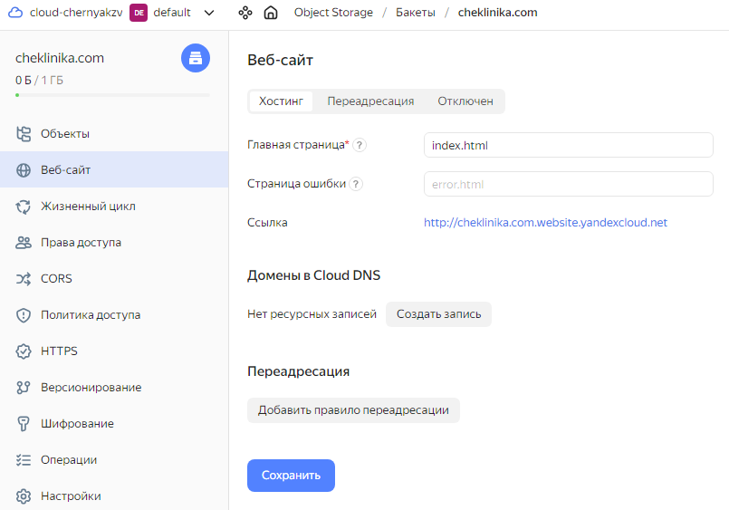

# Практическая работа. Хранение статических веб-сайтов в Object Storage

## Шаг 1. Создаем бакет
Создаем бакет `cheklinika.com` с типом хранения Стандарт и публичным доступом.

## Шаг 2. Загружаем файлы сайта в бакет
При помощи WinSCP, который умеет работать с S3, загружаем [файлы сайта](cheklinika.com).

## Шаг 3. Настраиваем сайт

Теперь сайт доступен по адресу - http://cheklinika.com.website.yandexcloud.net

